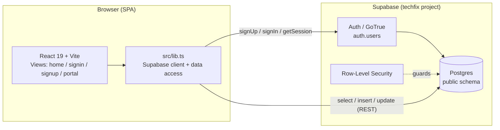
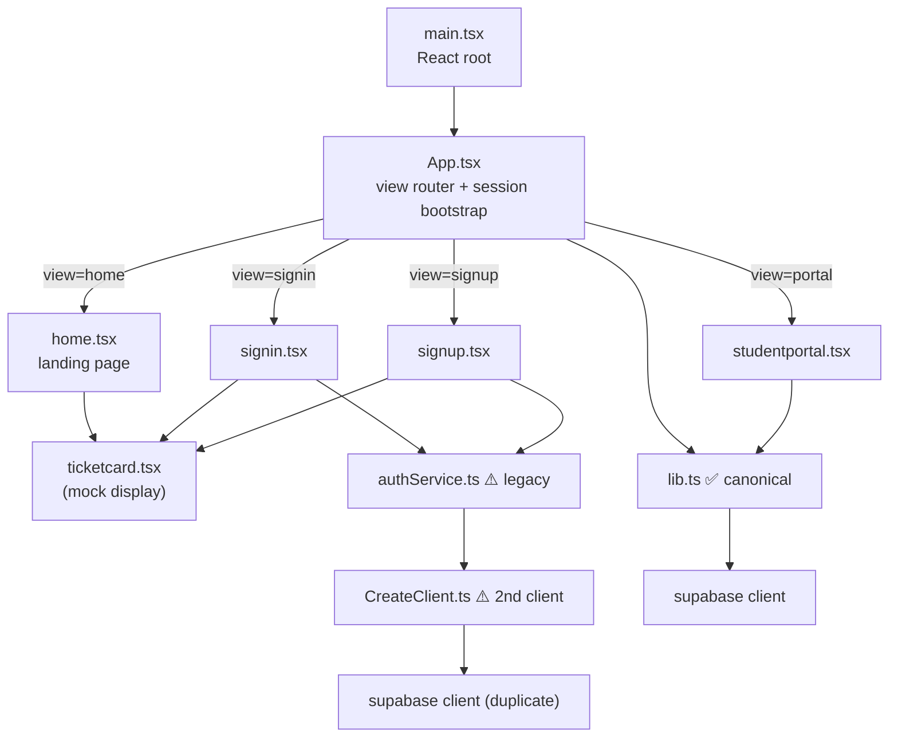
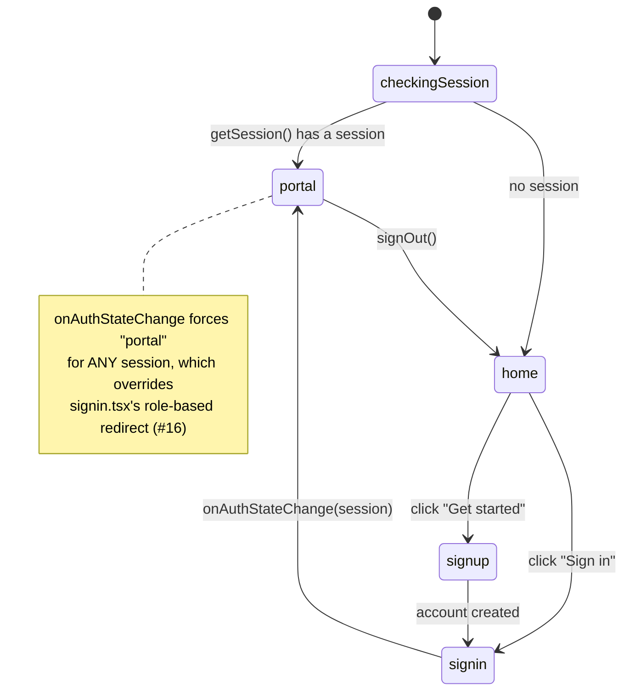
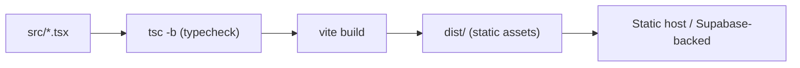

# Architecture

TechFix is a single-page React app talking directly to Supabase (Postgres + Auth) from the browser.
There is no custom backend server — the browser is the client, and Supabase enforces access rules
via Row-Level Security (RLS).

## System overview

The anon key ships in the client bundle (this is expected for Supabase). **All real protection must
come from RLS**, so any table the client touches needs policies. See
[DATA_MODEL.md](DATA_MODEL.md) for the intended policies and the gaps.

## Frontend component map

> ⚠️ Two Supabase clients and two auth layers currently coexist. `signin`/`signup` use the legacy
> `authService.ts` + `CreateClient.ts`, while `App`/`portal` use `lib.ts`. This should be consolidated
> to a single client — [#14](https://github.com/SeanixReal/Jobelonese/issues/14).

## Routing & session bootstrap

`App.tsx` is a hand-rolled state machine (no router library). View is a `useState`, and auth state
is observed with `supabase.auth.onAuthStateChange`.

> The role-based redirect computed in `signin.tsx` is dead code because `onAuthStateChange` always
> routes a signed-in user to `portal` — [#16](https://github.com/SeanixReal/Jobelonese/issues/16).
> There is also no staff destination yet — [#18](https://github.com/SeanixReal/Jobelonese/issues/18).

## Data access layer (`src/lib.ts`)

All Supabase reads/writes are centralized here. Functions throw on error; callers handle it.

| Group | Functions |
| --- | --- |
| Auth | `signUp`, `signIn`, `signOut`, `getCurrentProfile` |
| Tickets (student) | `createTicket`, `getMyTickets` |
| Tickets (staff — no UI yet) | `getNasQueue`, `getItQueue`, `claimTicket`, `forwardTicket`, `resolveTicket` |
| Reference data | `getLabs`, `getStations` |

See [WORKFLOWS.md](WORKFLOWS.md) for how these compose into user journeys.

## Build & tooling

- `npm run dev` — Vite dev server with HMR
- `npm run build` — `tsc -b` then `vite build`
- `npm run lint` — Oxlint
- No test runner or CI yet ([#27](https://github.com/SeanixReal/Jobelonese/issues/27)); the lint
  script also skips typechecking ([#28](https://github.com/SeanixReal/Jobelonese/issues/28)).
