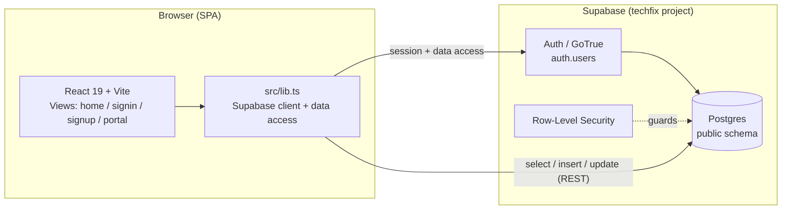
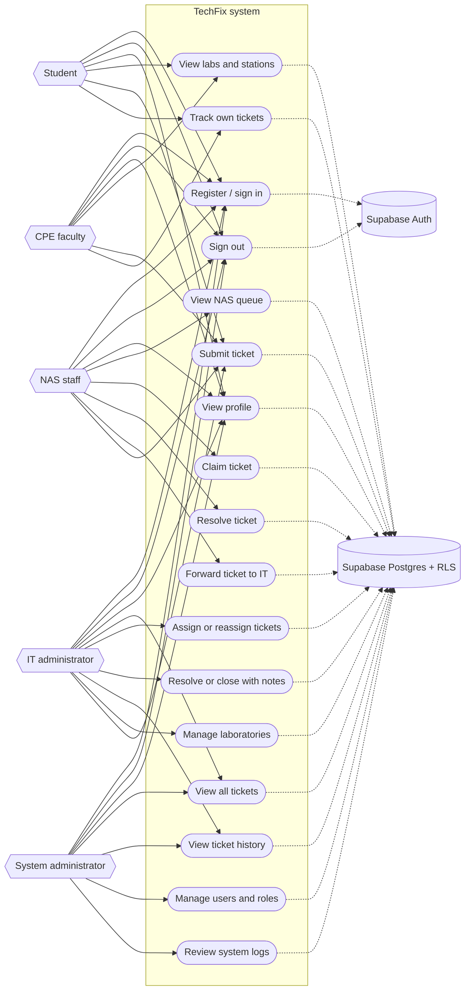
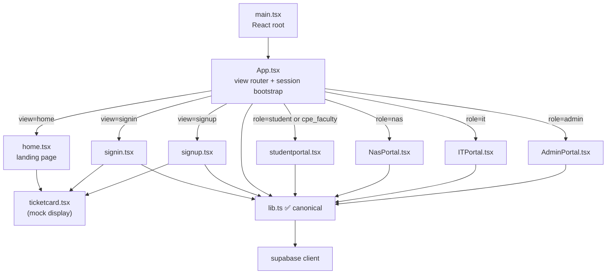
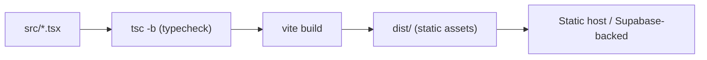

# Architecture

TechFix is a single-page React app talking directly to Supabase (Postgres + Auth) from the browser.
There is no custom backend server — the browser is the client, and Supabase enforces access rules
via Row-Level Security (RLS), Auth configuration, and database-side signup controls.

## System overview

The anon key ships in the client bundle (this is expected for Supabase). **All real protection must
come from RLS and server-side Auth controls**, so any table the client touches needs policies. See
[DATA_MODEL.md](DATA_MODEL.md) for the intended policies and the gaps.

## Use case diagram

The following use-case view reflects the current portal routing in `src/App.tsx`. CPE faculty is
supported by the role type and uses the student portal. The sign-up form does not offer any role;
new accounts start as students and administrators assign staff roles.

The diagram uses Mermaid flowchart notation for UML-style actors and use-case ellipses because
Mermaid does not provide a native `usecaseDiagram` block.

## Frontend component map

> `authService.ts` and `CreateClient.ts` remain as legacy compatibility files, but the auth forms now
> use the same `lib.ts` client as `App` and the portals. Do not add new call sites to the legacy pair.

## Routing & session bootstrap

`App.tsx` is a hand-rolled state machine (no router library). View is a `useState`, and auth state
is observed with `supabase.auth.onAuthStateChange`.

```mermaid
stateDiagram-v2
    [*] --> checkingSession
    checkingSession --> portal: getSession() has a session
    checkingSession --> home: no session

    home --> signin: click "Sign in"
    home --> signup: click "Get started"
    signup --> signup: account created; show verification message
    signup --> portal: account created without confirmation
    signin --> portal: onAuthStateChange(session)
    portal --> StudentPortal: role = student or cpe_faculty
    portal --> NasPortal: role = nas
    portal --> ITPortal: role = it
    portal --> AdminPortal: role = admin
    portal --> home: signOut()
```

> `onAuthStateChange` sets the top-level view to `portal`; `App.tsx` then loads the profile and selects
> `StudentPortal`, `NasPortal`, `ITPortal`, or `AdminPortal` from the role. The local redirect in
> `signin.tsx` is therefore redundant for non-student roles, but the staff destinations now exist.

## Data access layer (`src/lib.ts`)

Most Supabase reads/writes are centralized here, including sign-in and sign-up. The portals and
session bootstrap use the same client, so session events and Realtime subscriptions share one
Supabase connection.

| Group | Functions |
| --- | --- |
| Auth | `signUp`, `signIn`, `signOut`, `getCurrentProfile` |
| Tickets (student) | `createTicket`, `getMyTickets` |
| Tickets (NAS portal) | `getNasQueue`, `claimTicket`, `forwardTicket`, `resolveTicket` |
| Tickets (IT portal) | `getAllTickets`, `claimTicketAsIt`, `revokeAndReassignTicket`, `resolveTicketWithNotes`, `closeTicket`, `deescalateTicket`, `getTicketHistory` |
| Administration | `getAllUsers`, `updateUserRole`, `deleteUser`, `getAllTicketHistory` |
| Reference data | `getLabs`, `getStations` |

See [WORKFLOWS.md](WORKFLOWS.md) for how these compose into user journeys.

## Build & tooling

- `npm run dev` — Vite dev server with HMR
- `npm run build` — `tsc -b` then `vite build`
- `npm run lint` — Oxlint
- No test runner or CI yet ([#27](https://github.com/SeanixReal/Jobelonese/issues/27)); the lint
  script also skips typechecking ([#28](https://github.com/SeanixReal/Jobelonese/issues/28)).
