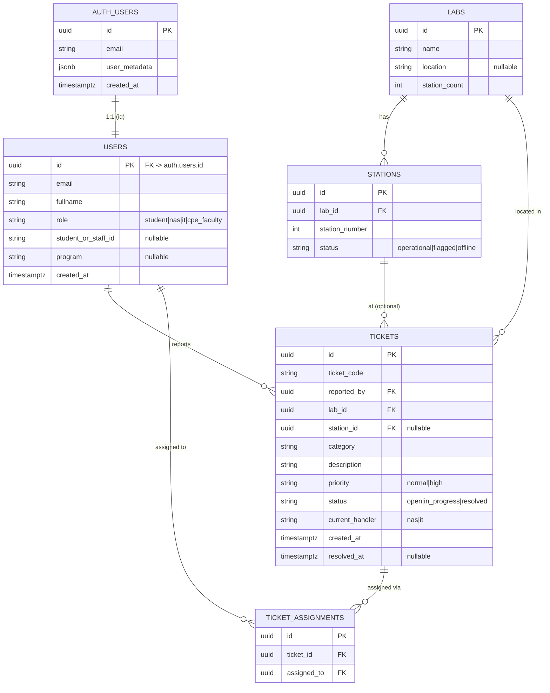

# Data Model

This is the schema the **application code expects** (derived from the TypeScript interfaces in
`src/lib.ts`). It is the intended target — the committed `DATABASE_SETUP.sql` is currently incomplete
and inconsistent with it (see the callouts below and
[#4](https://github.com/SeanixReal/Jobelonese/issues/4) /
[#5](https://github.com/SeanixReal/Jobelonese/issues/5)).

## Entity-relationship diagram

## Tables

### `users`
Profile mirror of `auth.users`, keyed by the same `id`.

| Column | Type | Notes |
| --- | --- | --- |
| `id` | uuid PK | references `auth.users(id)` ON DELETE CASCADE |
| `email` | text | unique |
| `fullname` | text | ⚠️ setup SQL calls this `fullName` → folds to `fullname`; keep it snake_case |
| `role` | text | CHECK in (`student`,`nas`,`it`,`cpe_faculty`) |
| `student_or_staff_id` | text | nullable — **missing from setup SQL** |
| `program` | text | nullable — **missing from setup SQL** |
| `created_at` | timestamptz | ⚠️ setup SQL calls this `createdAt` → `createdat` ([#4](https://github.com/SeanixReal/Jobelonese/issues/4)) |

> A row here should be created automatically when an `auth.users` row is inserted, via an
> `AFTER INSERT` trigger copying `user_metadata`. That trigger does not exist yet
> ([#6](https://github.com/SeanixReal/Jobelonese/issues/6)), so `getCurrentProfile()` fails for new users.

### `labs`
| Column | Type | Notes |
| --- | --- | --- |
| `id` | uuid PK | |
| `name` | text | |
| `location` | text | nullable |
| `station_count` | int | |

### `stations`
| Column | Type | Notes |
| --- | --- | --- |
| `id` | uuid PK | |
| `lab_id` | uuid FK | → `labs(id)` |
| `station_number` | int | |
| `status` | text | `operational` \| `flagged` \| `offline` |

### `tickets`
| Column | Type | Notes |
| --- | --- | --- |
| `id` | uuid PK | |
| `ticket_code` | text | human-friendly code (e.g. `TCK-0847`); needs a default/generator |
| `reported_by` | uuid FK | → `users(id)` |
| `lab_id` | uuid FK | → `labs(id)` |
| `station_id` | uuid FK | → `stations(id)`, nullable |
| `category` | text | issue type |
| `description` | text | |
| `priority` | text | `normal` \| `high`, default `normal` |
| `status` | text | `open` \| `in_progress` \| `resolved`, default `open` |
| `current_handler` | text | `nas` \| `it` — new tickets should default to `nas` |
| `created_at` | timestamptz | default `now()` |
| `resolved_at` | timestamptz | nullable |

> `createTicket` does not set `ticket_code`, `status`, or `current_handler`, so the table must supply
> defaults (and a `ticket_code` generator). Not present in setup SQL.

### `ticket_assignments`
Join rows written by `claimTicket` when a staffer picks up a ticket.

| Column | Type | Notes |
| --- | --- | --- |
| `id` | uuid PK | |
| `ticket_id` | uuid FK | → `tickets(id)` |
| `assigned_to` | uuid FK | → `users(id)` |

## Row-Level Security (RLS)

RLS is the only access control in this architecture (the anon key is public). Intended policies:

| Table | Policy intent |
| --- | --- |
| `users` | A user may `SELECT`/`UPDATE` **only their own row**. `role` must **not** be self-updatable ([#11](https://github.com/SeanixReal/Jobelonese/issues/11)). |
| `tickets` | Students `SELECT`/`INSERT` **only their own** (`reported_by = auth.uid()`). Staff (`nas`/`it`) may read their queue. |
| `stations`, `labs` | Readable by any authenticated user. |
| `ticket_assignments` | Insert/read limited to staff roles. |

> Today only `users` has policies, and they permit self-updating `role`. The ticket/lab/station tables
> have no policies because they don't exist yet. `getMyTickets` also fails to filter by owner in code
> ([#9](https://github.com/SeanixReal/Jobelonese/issues/9)), so it currently depends entirely on RLS
> that isn't there.

## Enumerations (from `src/lib.ts`)

| Type | Values |
| --- | --- |
| `Role` | `student`, `nas`, `it`, `cpe_faculty` |
| `TicketStatus` | `open`, `in_progress`, `resolved` |
| `TicketPriority` | `normal`, `high` |
| `HandlerRole` | `nas`, `it` |
| Station status | `operational`, `flagged`, `offline` |

> Note the divergent duplicates elsewhere: `ticketcard.tsx` uses `in-progress` (hyphen) and
> `signup.tsx` uses `cpe-faculty` (hyphen). Treat the `lib.ts` values above as canonical
> ([#8](https://github.com/SeanixReal/Jobelonese/issues/8), [#15](https://github.com/SeanixReal/Jobelonese/issues/15)).
