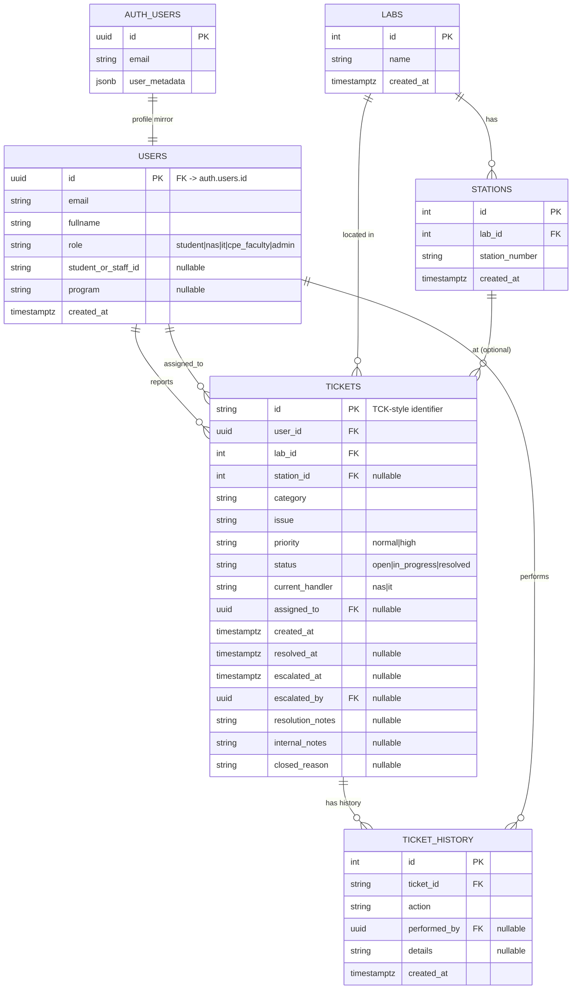

# Data Model

This document describes the schema used by the current application code and checked against the
deployed `techfix` Supabase Data API on 2026-07-13. The repository SQL is not a complete source of
truth: `DATABASE_SETUP.sql` creates only part of this model, while `IT_ROLE_MIGRATION.sql` adds the
ticket-history fields and table.

## Entity-relationship diagram

There is no `ticket_assignments` table in the deployed schema. Assignment is stored directly in
`tickets.assigned_to`, as implemented by `claimTicket`, `claimTicketAsIt`, and the reassignment
functions in `src/lib.ts`.

## Tables

### `users`

Profile mirror of `auth.users`, keyed by the same `id`.

| Column | Type | Notes |
| --- | --- | --- |
| `id` | uuid PK | references `auth.users(id)` |
| `email` | text | unique |
| `fullname` | text | used by `src/lib.ts` and the portals |
| `role` | text | code supports `student`, `nas`, `it`, `cpe_faculty`, and `admin` |
| `student_or_staff_id` | text | nullable |
| `program` | text | nullable |
| `created_at` | timestamptz | used by the application |

The live table also exposes legacy `createdat` and `updatedat` columns from the original setup SQL;
the application does not use them. There is no live `updated_at` column according to the schema probe.

`SUPABASE_REALTIME_AUTH_MIGRATION.sql` defines the `auth.users` profile-insert trigger. Without that
trigger or an equivalent server-side insert, a new Auth user can exist without a matching
`public.users` row.

### `labs`

| Column | Type | Notes |
| --- | --- | --- |
| `id` | integer PK | referenced by tickets and stations |
| `name` | text | laboratory name |
| `created_at` | timestamptz | |

The live table does not expose the `location` or `station_count` fields described by the previous
documentation.

### `stations`

| Column | Type | Notes |
| --- | --- | --- |
| `id` | integer PK | |
| `lab_id` | integer FK | references `labs(id)` |
| `station_number` | text | displayed as a station label/number |
| `created_at` | timestamptz | |

The live table does not expose the previously documented `status` field.

### `tickets`

| Column | Type | Notes |
| --- | --- | --- |
| `id` | text PK | application expects a ticket identifier such as `TCK-0851` |
| `user_id` | uuid FK | reporting user; this is not named `reported_by` |
| `lab_id` | integer FK | references `labs(id)` |
| `station_id` | integer FK | references `stations(id)`, nullable |
| `category` | text | issue type |
| `issue` | text | description supplied by the form; this is not named `description` |
| `priority` | text | `normal` or `high` |
| `status` | text | `open`, `in_progress`, or `resolved` |
| `current_handler` | text | `nas` or `it` |
| `assigned_to` | uuid FK | assigned staff user, nullable |
| `created_at` | timestamptz | |
| `resolved_at` | timestamptz | nullable |
| `escalated_at` | timestamptz | nullable |
| `escalated_by` | uuid FK | nullable |
| `resolution_notes` | text | nullable |
| `internal_notes` | text | nullable |
| `closed_reason` | text | nullable |

`createTicket` supplies `user_id`, `lab_id`, `station_id`, `category`, `issue`, and `priority`.
Database defaults must supply any other required values.

### `ticket_history`

| Column | Type | Notes |
| --- | --- | --- |
| `id` | serial PK | |
| `ticket_id` | varchar FK | references `tickets(id)` |
| `action` | text | e.g. claimed, resolved, escalated |
| `performed_by` | uuid FK | references `users(id)`, nullable on delete |
| `details` | text | nullable |
| `created_at` | timestamptz | defaults to `now()` |

## Row-Level Security

The browser uses a publishable Supabase key, so authorization must be enforced by RLS and by
server-side role controls.

| Table | Required policy intent |
| --- | --- |
| `users` | A user may read/update only their own row; role must not be self-updatable. Staff/admin broad reads and role changes must be explicitly restricted. |
| `tickets` | Students may insert/read only their own tickets. NAS and IT may read and update only the queues/actions assigned to their role. |
| `labs`, `stations` | Authenticated users may read reference data; management writes are limited to IT/admin. |
| `ticket_history` | Staff/admin may read appropriate history; inserts must be authenticated and tied to the acting user. |

The current client code now adds the explicit `user_id` filter for `getMyTickets()`. Signup no longer
accepts a role, and the migration's profile trigger assigns `student`; the private role-assignment
trigger is the database authorization boundary for later changes. The live schema probe confirmed
table/column availability but did not expose policy definitions through the available connector
permissions.

## Realtime and signup enforcement

The client subscribes to Postgres Changes for `tickets` so student, NAS, IT, and admin views update
after a ticket is created or changed without a manual reload. The IT and admin views also subscribe to
the related `users`, `labs`, `stations`, and `ticket_history` tables used by their dashboards.

Realtime still evaluates the subscriber's RLS policies; adding a table to the
`supabase_realtime` publication does not grant access to rows. Run
`SUPABASE_REALTIME_AUTH_MIGRATION.sql` in the intended Supabase project to add the tables to that
publication.

New Auth users are restricted to the exact `@cit.edu` domain by the same migration's database
trigger. It also defines `public.hook_restrict_signup_by_email_domain` for the Supabase Before User
Created hook. The client-side check in `src/lib.ts` is only an early validation and is not the
security boundary.

Station numbers are canonicalized by trimming and collapsing whitespace. The migration moves ticket
references off duplicate station rows before deleting duplicates, then enforces uniqueness per lab
with `lower(btrim(station_number))`. Duplicate station inserts are rejected by both the client and
the database constraint.
## Enumerations used by the code

| Type | Values |
| --- | --- |
| `Role` | `student`, `nas`, `it`, `cpe_faculty`, `admin` |
| `TicketStatus` | `open`, `in_progress`, `resolved` |
| `TicketPriority` | `normal`, `high` |
| `HandlerRole` | `nas`, `it` |

The sign-up form does not offer a role. New users start as `student`; administrators can assign
`nas`, `it`, `cpe_faculty`, or `admin` from the Admin portal after the database role guard is installed.
