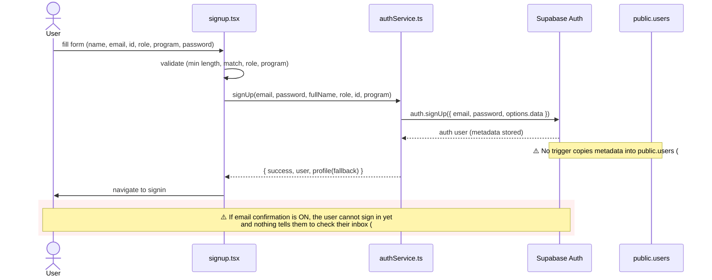
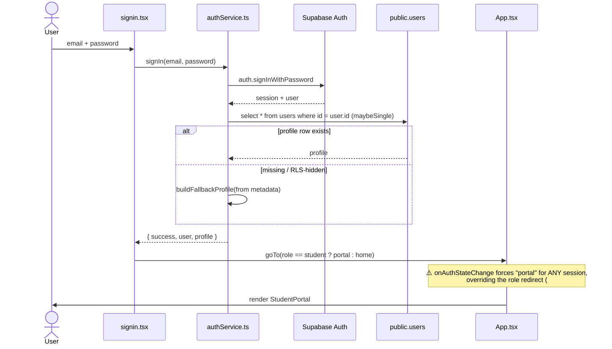
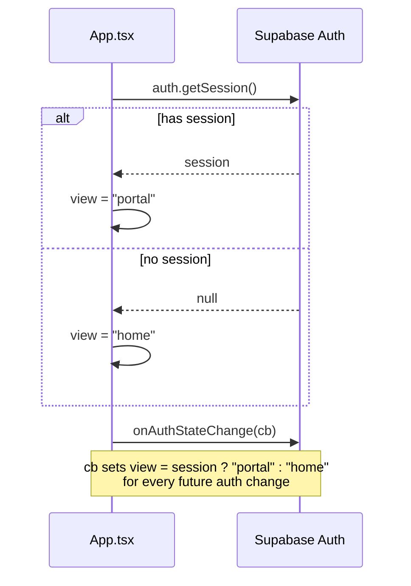
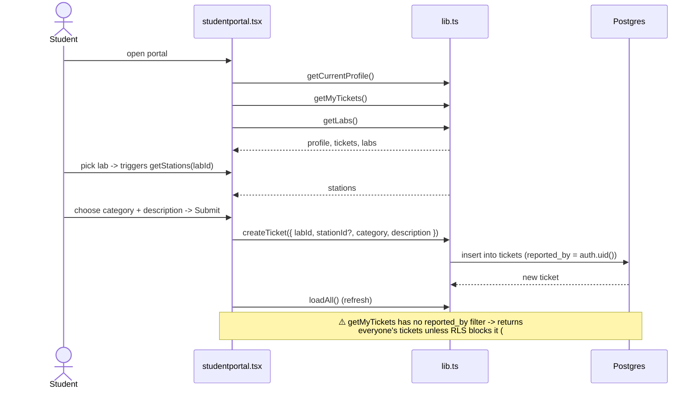
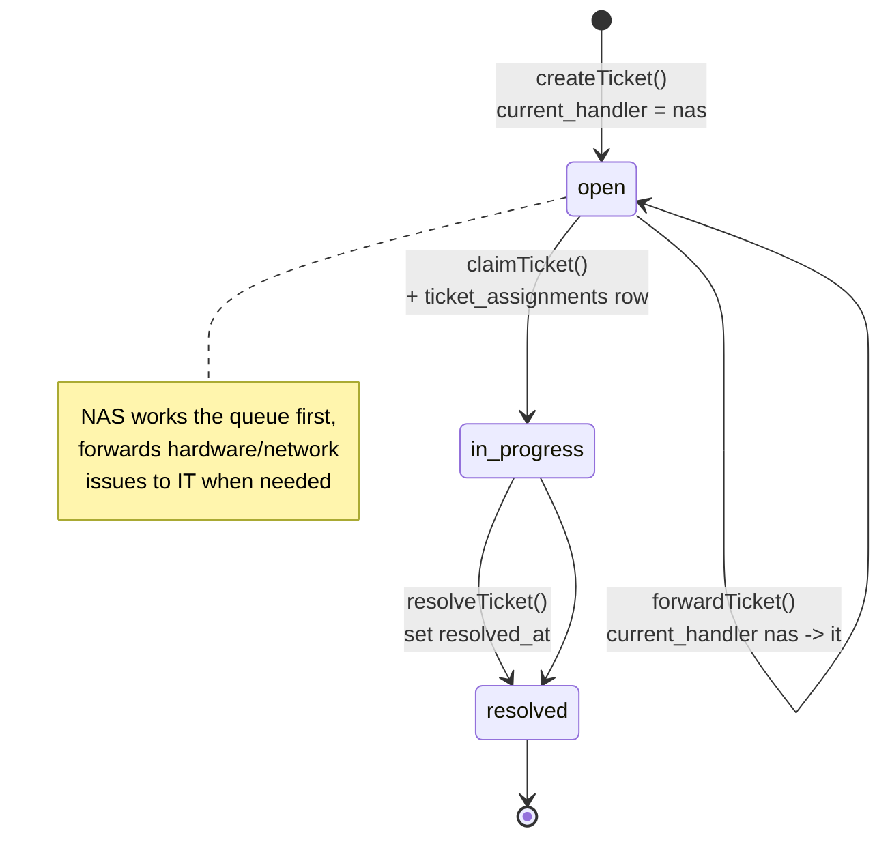
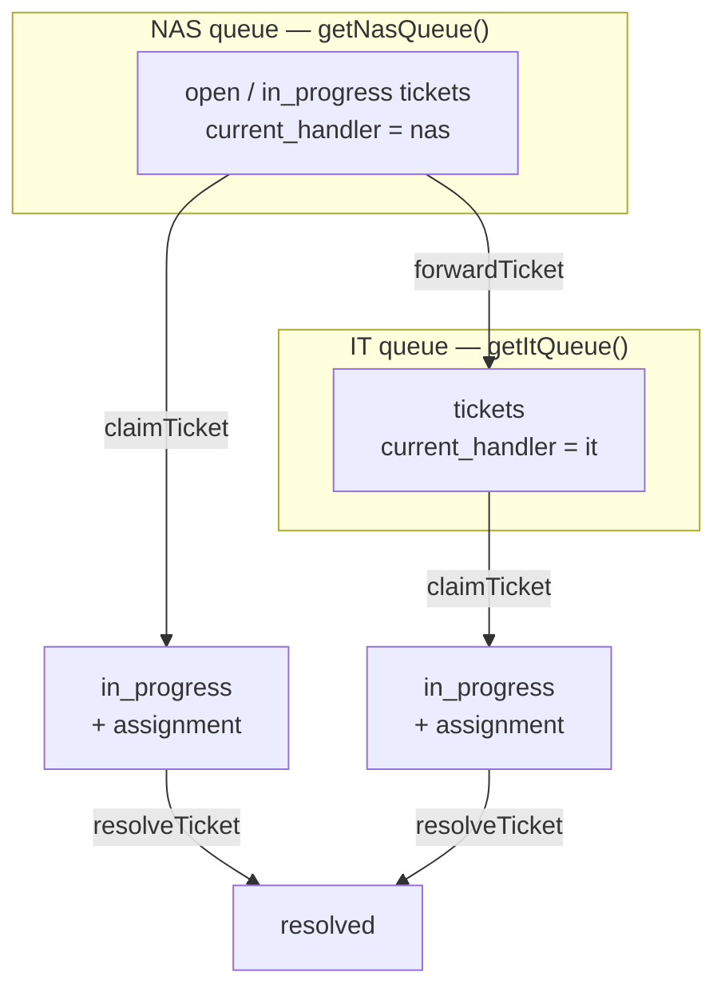
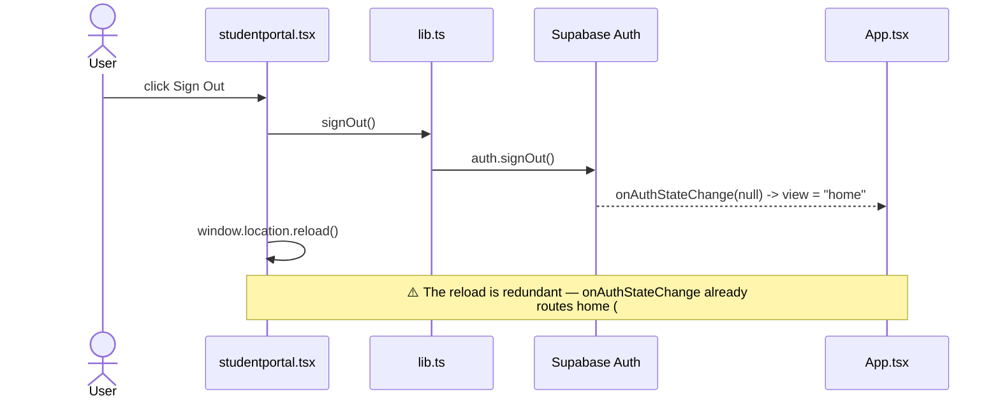

# Workflows

How the pieces in [ARCHITECTURE.md](ARCHITECTURE.md) and [DATA_MODEL.md](DATA_MODEL.md) compose into
user journeys. Diagrams reflect the code as written today; ⚠️ callouts mark where a flow is broken or
incomplete.

## Sign-up

## Sign-in

## Session bootstrap on load

## Report a ticket (student)

## Ticket lifecycle (state machine)

## Staff queue (designed, not yet built)

The functions exist in `src/lib.ts` but no component calls them — there is no staff UI
([#18](https://github.com/SeanixReal/Jobelonese/issues/18)).

## Sign-out

