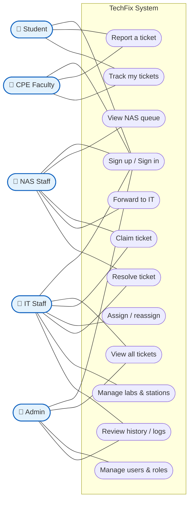
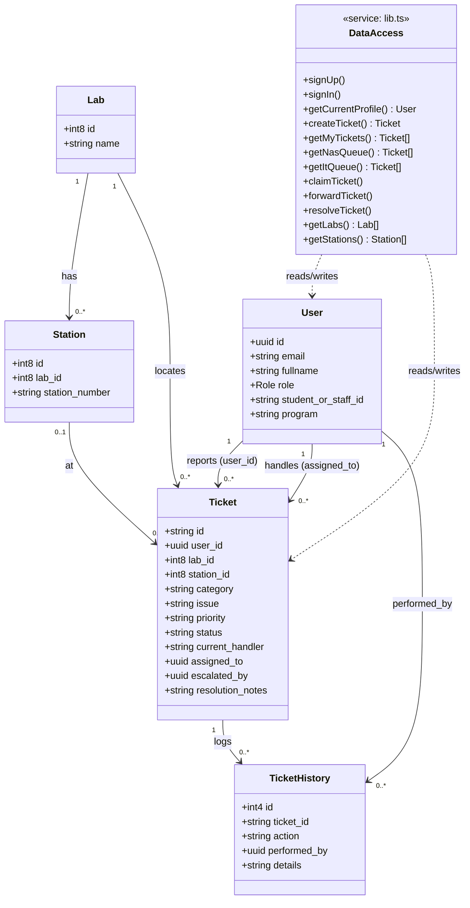
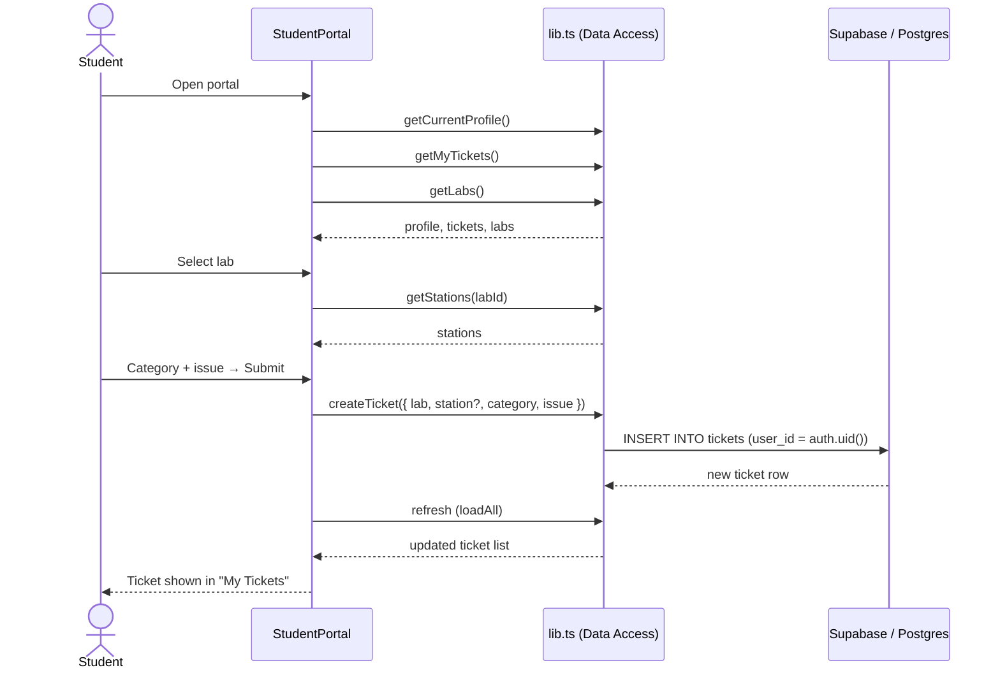
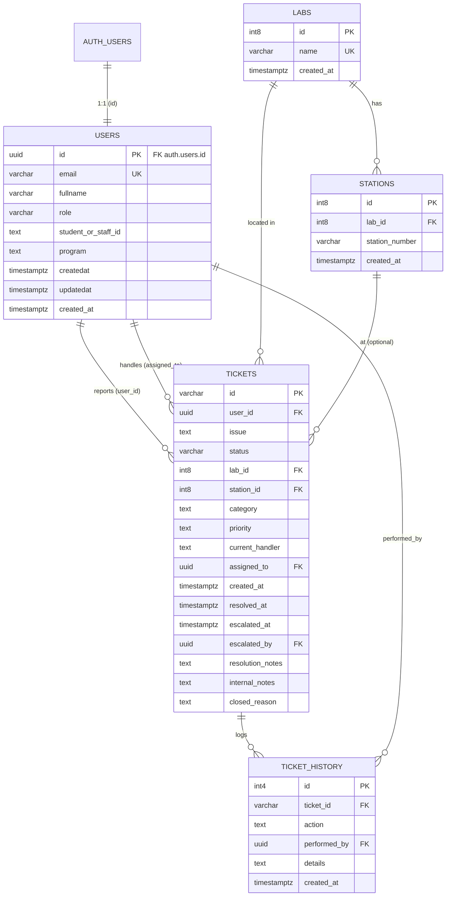

# TechFix — UML Diagrams

Presentation-ready UML for the **TechFix** CIT-U Computer Lab Support system.
All diagrams use Mermaid so they render on GitHub and can be exported as images
for slides. Keep only the **core** version on a slide; link the full version in
your documentation (per the presentation guide).

Contents: [Use Case](#1-use-case-diagram) · [Class](#2-class-diagram) ·
[Sequence](#3-sequence-diagram) · [ERD](#4-entity-relationship-diagram-erd)

---

## 1. Use Case Diagram

Who does what. Mermaid has no native use-case notation, so actors (left/right)
connect to ovals (use cases) inside the system boundary.

> **Slide tip:** all four role portals — Student, NAS, IT, and Admin — exist and
> route by role in `App.tsx`. The staff and admin workflows are prototype-level
> and still need live-schema/RLS verification before production (see the README).
> The **student report → track** path is the most complete, so lead your live
> demo with it. This mirrors the fuller use-case diagram in
> [../ARCHITECTURE.md](../ARCHITECTURE.md#use-case-diagram).

---

## 2. Class Diagram

Object-oriented structure derived from `src/lib.ts` — the data-access layer,
its types, and the entities it reads/writes.

---

## 3. Sequence Diagram

Core flow: **a student reports a ticket.** (Sign-up, sign-in, and sign-out
sequences live in [../WORKFLOWS.md](../WORKFLOWS.md).)

---

## 4. Entity-Relationship Diagram (ERD)

The database backbone as it exists **live in Supabase** — how a ticket links to
the student, lab, station, and its audit trail. `assigned_to`, `escalated_by`,
and `ticket_history.performed_by` all reference `users(id)`.

> This reflects the **deployed** schema (verified against the Supabase table
> view). For the authoritative column-level schema, types, RLS intent, and the
> guarded workflow RPCs, see [../DATA_MODEL.md](../DATA_MODEL.md) — this ERD is
> consistent with it.

> Full column-level schema, types, and RLS notes: [../DATA_MODEL.md](../DATA_MODEL.md).
